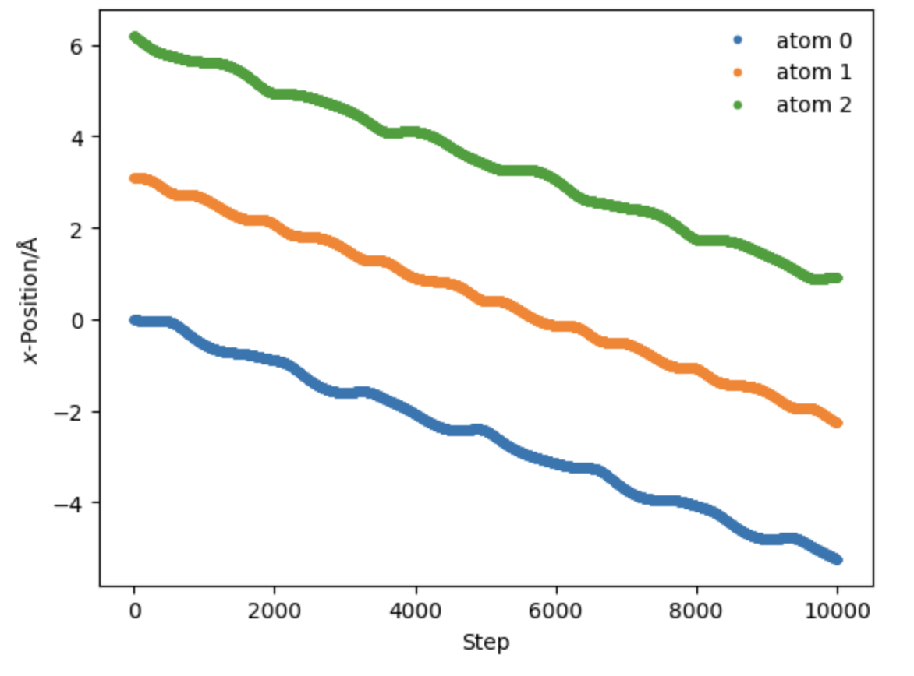

# Docker for achieving reproducibility

## Introduction

In this exercise we will show how docker can be used to assist us in achieving reproducibility in science. The [reproducibility crisis](https://www.nature.com/articles/533452a), is well understood to span many fields including [medicine](https://journals.plos.org/plosmedicine/article/info%3Adoi%2F10.1371%2Fjournal.pmed.0020124) and [psychology](https://www.nature.com/articles/s44271-023-00003-2), but also affects [chemistry](https://www.chemistryworld.com/news/taking-on-chemistrys-reproducibility-problem/3006991.article).

As practitioners of computational chemistry however, we are uniquely positioned to enable replication of our results and provide access to the precise computational environments that produced them. In particular, containerization provides a straightforward method for "freezing" the computational environment in which our simulations were run. Though this is not always feasible, there are many cases for which this is possible.

## Lab Overview

We illustrate this premise here by exploring reproducibility using a Lennard-Jones potential.

In particular, we are going to illustrate how three pieces of your working environment can be serialized in a container:

1. The version of a dependency
2. The version of your own source code
3. Input data for your simulation

## Prerequisites

1. A local python installation
2. A local docker installation
3. This repository, cloned
4. The toy Lennard-Jones MD code, cloned: https://github.com/mcgalcode/lennard-jones-md

## Setting the scene

You are a computational chemist who has recently produced an exciting (!!) result using a barebones one-dimenionsal Lennard-Jones molecular dynamics simulation. You want to publish this result, and you want to ensure that others can reproduce your result exactly. To do this you plan to use docker to precisely define the computing environment that produces the results of your simulation.

You are aware that the simulation output is sensitive to various pieces of the simulation inputs:

1. The initial conditions (temperature and particle positions and velocities)
2. The form of the potential (e.g. equilibrium distance)

You are also aware that the code you used to produce this simulation is under very active development. As a result, you want to ensure your docker container has exactly the version used to produce your simulation results. In terms of computing environment you want to enshrine the following in your image:

1. You used python 3.12.5 to produce your simulation results
2. [The package](https://github.com/mcgalcode/lennard-jones-md) you used hasn't worked since commit 8832a79. You'll want to make sure that is the version that's installed in your image.

Finally, to make it particularly easy for others to view your results, you want to use jupyter lab to provide an easy way of visualizing the outputs without requiring people who are using your image to install the jupyter environment themselves.

## Instructions

### Get the simulation running locally

Before trying to create this docker image, it may be helpful to make sure you can get the `run_simulation.py` script running locally. To do this you'll need to:

1. Install the [lennard_jones_md](https://github.com/mcgalcode/lennard-jones-md) package locally (perhaps in a virtualenv or a conda environment) **remember to checkout the last working commit: 8832a79**.
2. Fill out the `inputs.json` file. This will involve at a minimum
    - Selecting a simulation temperature (a positive integer)
    - Generating a set of initial random velocities. To make these velocities, use a python REPL and invoke the `LennardJonesMolecularDynamics.initialize_velocities()` method using the temperature you selected and `3` for the number of particles.

    For example, if you selected a temperature of 300K, this invocation would look like:

```
>>> LennardJonesMolecularDynamics.initialize_velocities(300, 3)
```

You can invoke the `run_simulation.py` script using

```
python run_simulation.py
```

If it runs successfully, a file called `sim_output.json` containing a list of particle positions will be produced.

To confirm that the simulation was run successfully, use `jupyterlab` or `jupyter-notebook` to run `visualize_output.ipynb` and see the trajectories associated with your simulation output.

If that notebook works, and you see a plot that looks like this:



You are ready to move on to creating your Dockerfile!

### Creating a Dockerfile to serialize your simulation environment

Fill in the `Dockerfile` to create an image that allows others to reproduce your science!

1. Choose the python 3.12.5 image as the base image
2. **Add dependency**
Add a line that installs the lennard_jones_md package from github by cloning the repository, and checking out the code at commit 8832a79. We want to check out a specific commit because we are trying to create an image that fossilizes exactly the environment used to produce simulation results. If this was a package that was under active development the latest version may be incompatible with your use of it (this is exactly the case here).
3. **Add source code**: Make sure to include `run_simulation.py` in your docker image.
4. **Add inputs to docker image**: Add your completed `inputs.json` file to the docker image.
5. **Run your simulation** Invoke the `run_simulation.py` script to ensure that the outputs are produced and included correctly in the container environment.

Once you have finished these steps, run a container interactively using this image and confirm that the `sim_outputs.json` file is included as expected.

### Jupyter Lab for visualization

To make it easier for other researchers to view your results in the docker container environment, let's try to run jupyter from inside the container. You'll need to install the python `jupyterlab` package (along with `matplotlib`, a dependency of `visualize_output.ipynb`), then use a `CMD` line to define the jupyter lab invocation. Finally, in order to make a network port (jupyter typically runs on localhost:8888) in the container available on the host, you'll need to construct a `docker run` invocation that includes the `-p` flag, which maps a port on the host to a port inside the container.

The following tips will be helpful:

- You can use the `EXPOSE` command inside your Dockerfile to indicate which ports should be made available to the host
- When you invoke jupyter inside the container, you may need the flags: "--ip=0.0.0.0", "--allow-root", and "--no-browser"
- When you use `docker run` to run your container, you'll want to use `-p xxx:yyy` where yyy is the port inside the container and xxx is the port on the host machine to which it should map

### Register your container on Docker Hub

How can you make the work you've done available to others? Docker Hub provides a centralized repository of images which anyone can pull for their own use. Though there are other ways to distribute your own images, this is probably the most straightforward. Try to create an account on Docker Hub, upload the image you've produced, and have someone else in your group pull it and run it. They should be able to visualize the results of your simulation by running the correct `docker run` command!

Keep in mind:

- You'll need to create a Repository before you can push
- Choose a recognizable name for your repository
- Feel free to delete your image and repository after someone else has successfully run it on their machine (though of course this would be antithetical to the reproducibility goal of this lab if it weren't a toy problem...)